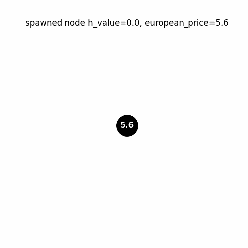

# **Nested Monte Carlo for Bermudan Option Valuation**



## 1. Introduction

Bermudan options are financial derivatives that grant the holder the right, but not the obligation, to exercise the option at a finite set of pre-specified dates. This places them between European options (exercisable only at maturity) and American options (exercisable at any time before maturity). The valuation of Bermudan options presents a significant computational challenge, as it requires solving an optimal stopping problem. The holder must decide, at each potential exercise date, whether to exercise the option immediately or to continue holding it, hoping for more favorable market conditions in the future. This decision-making process depends on the expected future value of the option, which is itself contingent on future market movements. This "optimal stopping" nature of Bermudan option pricing makes closed-form solutions generally unavailable, necessitating numerical methods like Monte Carlo simulation.

Traditional Monte Carlo methods suffer from the high dimensionality of the stopping rules space when applied to Bermudan option pricing. As the number of exercise dates increases, the computational effort required to achieve a desired level of accuracy grows exponentially.  Therefore, efficient and accurate Monte Carlo techniques are essential. This report evaluates the **random tree method** proposed by P. Glasserman in *Monte Carlo methods in financial engineering*, volume 53 of *Applications of Mathematics (New York)*. Springer-Verlag, a powerful technique that provides both **high and low biased estimators** of the Bermudan option price. These estimators are crucial because they allow us to construct confidence intervals, providing a measure of the uncertainty associated with the price estimate. We further extend the core random tree method with several enhancements, including variance reduction techniques using antithetic variates, a pruning strategy based on European option prices.

## 2. Mathematical Formulation

### 2.1 Bermudan Option Pricing

We assume that the underlying asset price, $\Huge S(t)$, follows a geometric Brownian motion under the risk-neutral probability measure. The underlying asset is described by the following stochastic differential equation given by the Black-Scholes model:


$$
\Huge
dS(t) = rS(t)dt + \sigma S(t)dW(t),
$$

where:

*   $\Huge r$ is the risk-free interest rate.
*   $\Huge \sigma$ is the volatility of the underlying asset price.
*   $\Huge W(t)$ is a standard Brownian motion, representing the random fluctuations in the asset price.

We denote the possible exercise opportunities by the set $\Huge (t_1, t_2, \dots, t_m)$. The asset price at each exercise date $\Huge t_i$ is denoted by $\Huge S_i = S(t_i)$.  For a Bermudan put option, the payoff at exercise date $\Huge t_i$ is given by:

$$
\Huge
h_i(S_i) = \max(K - S_i, 0),
$$

where $\Huge K$ is the strike price of the option. This represents the immediate gain the holder receives upon exercising the option at time $\Huge t_i$ when the asset price $\Huge S_i$ is below the strike price $\Huge K$.

The fundamental goal of Bermudan option pricing is to find the option value at time zero, $\Huge V_0$. This is defined as the supremum over all admissible exercise strategies $\Huge \tau$ belonging to the set $\mathcal{T}$ of all possible exercise times:

$$
\Huge
V_0 = \sup_{\tau \in \mathcal{T}} \mathbb{E}\left[e^{-r\tau}h_\tau(S_\tau)\right].
$$

This equation states that the value of the Bermudan option is the highest expected discounted payoff that can be achieved by optimally choosing the exercise time $\tau$. The expectation is taken under the risk-neutral measure, and the payoff is discounted back to time zero using the risk-free rate $\Huge r$.

### 2.2 Dynamic Programming Recursion

To find the optimal exercise strategy and value, we use dynamic programming, working backward from the expiration date.  The value function $\Huge V_i(S)$ at time $\Huge t_i$ represents the value of the option if it is still alive at that time and the asset price is $\Huge S$. It satisfies the following recursive equation:

$$
\Huge
V_i(S) = \max{h_i(S), C_i(S)},
$$

where:

*   $\Huge h_i(S)$ is the immediate exercise value at time $t_i$, as defined in the previous section.
*   $\Huge C_i(S) = \mathbb{E}\left[e^{-r(t_{i+1}-t_i)}V_{i+1}(S_{i+1}) \mid S_i = S\right]$ is the continuation value.  This represents the expected discounted value of holding the option until the next exercise date, $t_{i+1}$, given that the current asset price is $S_i = S$.  Calculating the continuation value is the most challenging part of the dynamic programming recursion because it involves evaluating a conditional expectation.

The backward recursion starts at the final exercise date, $t_m$, where the value function is simply the payoff:

$$
\Huge
V_m(S) = h_m(S).
$$

The problem lies in accurately estimating the continuation value $\Huge C_i(S)$ at each exercise date, as it depends on the future value of the option.  The random tree method provides a way to approximate this continuation value using Monte Carlo simulation.

### 2.3 Random Tree Method

The random tree method approximates the continuation value $\Huge C_i(S)$ using a tree-like structure. At each node in the tree, representing a possible asset price at a specific exercise date, we generate multiple "branches" representing possible future asset prices. The number of branches emanating from each node is called the branching factor, denoted by $\Huge b$.

1.  **High Estimator** $\Huge \hat{V}_i^{j_1\cdots j_i}$: The high estimator is intentionally biased *upward*.  This bias arises from using *all* of the $\Huge b$ paths to estimate the continuation value. In effect, the holder is assumed to know all the future stock prices and makes the optimal decision based on these future prices. This results in overestimating the continuation value and therefore the option price. The recursive definition is as follows:

    $$
    \begin{cases}
    \hat{V}_m^{j_1\cdots j_m} = h_m(X_m^{j_1\cdots j_m}) \\
    \hat{V}_i^{j_1\cdots j_i} = \max\left\{h_i(X_i^{j_1\cdots j_i}), \frac{1}{b}\sum_{j=1}^b \hat{V}_{i+1}^{j_1\cdots j_ij}\right\}
    \end{cases}
    $$

    where $\Huge X_i^{j_1\cdots j_i}$ represents the simulated asset price at time $\Huge t_i$ along path $\Huge j_1, \dots, j_i$.  The high estimator at time $\Huge t_i$ is the maximum of the immediate exercise value and the average of the high estimators at the next time step, $\Huge t_{i+1}$, along each of the $\Huge b$ branches.  The provided Python code accurately implements this:

    ```python
    def high_estimator(x: float, # current state
                       i: int, # current level, 0 <= i <= m
                       b: int, # branching factor
                       m: int, # number of exercise opportunities
    ):
        if i == m:
            return h(m, x)

        successors = [X(x, i+1) for _ in range(b)] # generate b successors
        values = [high_estimator(next_x, i+1, b, m) for next_x in successors]

        return max(h(i, x), np.mean(values))
    ```

    The function recursively calculates the high estimator. At each step, it generates $\Huge b$ successors (future asset prices) and calculates the high estimator for each successor. It then takes the maximum of the immediate exercise value and the average of these successor estimators.

3.  **Low Estimator** $\Huge \hat{v}_i^{j_1\cdots j_i}$: The low estimator, conversely, is intentionally biased *downward*.  This bias is achieved by excluding one path when making the exercise decision.  In other words, the decision to exercise at time $\Huge t_i$ is made based on the *average* continuation value over *all but one* of the $b$ branches. The holder makes the decision without all the information. This leads to an underestimation of the true continuation value and, therefore, a lower estimate of the option price. The recursive definition is:

    $$
    \begin{cases}
    \hat{v}_m^{j_1\cdots j_m} = h_m(X_m^{j_1\cdots j_m}) \\
    \hat{v}_i^{j_1\cdots j_i} = \frac{1}{b}\sum_{k=1}^b
        \begin{cases}
            h_i(X_i^{j_1\cdots j_i}), & \text{if } \frac{1}{b-1}\sum_{j \neq k} \hat{v}_{i+1}^{j_1\cdots j_ij} \leq h_i(X_i^{j_1\cdots j_i}), \\
            \hat{v}_{i+1}^{j_1\cdots j_ik}, & \text{otherwise}.
        \end{cases}
    \end{cases}
    $$

    At each node, the low estimator considers each branch $\Huge k$ in turn.  It calculates the average continuation value over all other branches ($\Huge j \neq k$).  If this average continuation value is *less than* the immediate exercise value, then it assumes the option is exercised at time $\Huge t_i$ along branch $\Huge k$. Otherwise, it assumes the option is held and uses the low estimator along branch $\Huge k$. The overall low estimator is then the average of these decisions across all branches. This carefully implemented "leaving one out" approach is what generates the low bias.

    ```python
    def low_estimator(x: float, # current state
                       i: int, # current level, 0 <= i <= m
                       b: int, # branching factor
                       m: int, # number of exercise opportunities
    ):
        if i == m:
            return h(m, x)

        successors = [X(x, i+1) for _ in range(b)] # generate b successors
        values = [high_estimator(next_x, i+1, b, m) for next_x in successors]
        mask = (np.sum(values) - values)/(b-1) <= h_value

        return max(h(i, x), np.mean(h_value * mask + values * ~mask))
    ```

    Again, the function recursively calculates the low estimator.  The crucial part is the calculation of `mask`, which determines whether to exercise along a given path based on the average continuation value of the other paths.

The high and low estimators provide a natural way to construct confidence intervals for the Bermudan option price.  Since the true price lies between the high and low estimates, we can use the sample means and standard deviations of these estimators to construct a confidence interval that, with a certain probability (e.g., 95%), contains the true option price.  Importantly, the random tree method converges as $\Huge b$ increases.

## 3. Numerical Methods

### 3.1 Base Implementation

We value a Bermudan put option with the following parameters:

*   $\Huge S_0 = 100$ (Initial asset price)
*   $\Huge K = 100$ (Strike price)
*   $\Huge r = 0.05$ (Risk-free interest rate)
*   $\Huge \sigma = 0.2$ (Volatility)
*   $\Huge T = 1$ (Time to maturity)
*   $\Huge m = 3$ (Number of exercise opportunities)

We varied the branching factor, $b$, among the values $\Huge \{5, 10, 20, 50\}$ and used $\Huge n = 1000$ independent replications of the random tree to estimate the high and low estimators.  The 95% confidence intervals were constructed using the standard formula: Sample Mean $\Huge \pm$ 1.96 * (Sample Standard Deviation / $\Huge \sqrt{n}$).

| $b$ | $n$  | High Estimate | 95% CI          | Time (s) |
|-----|------|---------------|-----------------|----------|
| 5   | 1000 | 6.75          | (6.58, 6.92)    | 0.4      |
| 10  | 1000 | 6.54          | (6.43, 6.65)    | 3.1      |
| 20  | 1000 | 6.33          | (6.43, 6.64)    | 21       |
| 50  | 1000 | 6.22          | (6.18, 6.26)    | 312      |
| $b$ | $n$  | **Low Estimate**  | **95% CI**          | **Time (s)** |
| 5   | 1000 | 6.24          | (6.07, 6.40)    | 0.9      |
| 10  | 1000 | 6.24          | (6.14, 6.35)    | 4.7      |
| 20  | 1000 | 6.26          | (6.18, 6.33)    | 29.3     |
| 50  | 1000 | 6.18          | (6.13, 6.22)    | 399      |

As expected, as the branching factor $b$ increases, the high estimator decreases, and the low estimator increases, leading to tighter confidence intervals. However, the computational time increases dramatically with $\Huge b$ because the size of the tree grows exponentially with $\Huge b$.

### 3.2 Enhancements

To improve the efficiency of the random tree method, we implemented several enhancements.

#### 3.2.1 Pruning:

The key idea behind pruning is to reduce the size of the tree by eliminating branches that are unlikely to be exercised. We implemented two pruning strategies:

*   **European Option Price Bound:** If, at a given node, the immediate exercise value $\Huge h_i(S_i)$ is less than the price of a corresponding European put option (with the same strike price and maturity), we know that it is not optimal to exercise the Bermudan option at that node. This is because the European option provides a guaranteed minimum value that is greater than the immediate exercise value. Therefore, we can "prune" the tree at that node by generating only a *single* branch instead of $b$ branches. We then propagate the value of this single successor node back to the parent node in both the high and low estimators.

    ```python
    if i > 0 and h(m, x) < european_price:
            value = single_step()
            return value # propagate the value of the only successor
    ```

*   **Terminal Step Pruning:** At the $\Huge (m-1)$th exercise date, we know that the value of the American option is the maximum of the immediate exercise value and the value of a European option expiring at $t_m$. This eliminates the need to generate any branches at this stage, effectively reducing the size of the tree by a factor of $b$.

    ```python
    # if i == m:
    #    return h_value
    if i == m-1:
           return max(h_value, european_price)
    ```

To assess the effectiveness of the pruning strategies, we tracked the number of node evaluations and calculated the percentage of nodes that were pruned. The total number of nodes in an unpruned tree (excluding the final exercise date) is $\Huge \dfrac{b^m - 1}{b-1}$.

**Optimized Implementation Results:**

| $b$   | $n$   | High Estimate | 95% CI          | Evaluated nodes | Pruned (%) | Time (s) |
|-------|-------|---------------|-----------------|-----------------|------------|----------|
| 5     | 1000  | 6.41          | (6.22, 6.61)    | 14,384          | 53.6       | 1.3      |
| 10    | 1000  | 6.30          | (6.17, 6.44)    | 35,616          | 67.9       | 3.1      |
| 20    | 1000  | 6.14          | (6.05, 6.23)    | 100,926         | 76.0       | 9.1      |
| 50    | 1000  | 6.09          | (6.03, 6.15)    | 489,717         | 80.8       | 43.5     |
| 100   | 1000  | 6.16          | (6.12, 6.20)    | 1,770,051       | 82.48      | 159      |
---
| $b$   | $n$   | Low Estimate  | 95% CI          | Evaluated nodes | Pruned (%) | Time (s) |
|-------|-------|---------------|-----------------|-----------------|------------|----------|
| 5     | 1000  | 6.13          | (5.94, 6.32)    | 14,084          | 54.6       | 1.3      |
| 10    | 1000  | 6.20          | (6.06, 6.33)    | 35,175          | 68.3       | 3.2      |
| 20    | 1000  | 6.17          | (6.08, 6.27)    | 100,033         | 76.2       | 9.2      |
| 50    | 1000  | 6.07          | (6.08, 6.20)    | 486,679         | 80.9       | 44.8     |
| 100   | 1000  | 6.10          | (6.06, 6.14)    | 1,764,210       | 82.5       | 160.7    |

The results demonstrate that the pruning strategies significantly reduce the number of node evaluations, leading to a substantial speedup in computation time. The percentage of pruned nodes increases with the branching factor, indicating that the pruning becomes more effective as the tree grows larger. Note that the pruned tree can have more or less than $\Huge b^m$ nodes, it depends on the number of suboptimal nodes, for which we create only 1 successor instead of $b$ successors.

#### 3.2.2 Antithetic Variates:

Antithetic variates is a variance reduction technique that aims to reduce the variance of the Monte Carlo estimator by introducing negative correlation between pairs of simulated paths. We implemented this by generating pairs of standard normal random variables $\Huge (\epsilon, -\epsilon)$ for the increments of the geometric Brownian motion.

Specifically, for each node in the tree, we spawn *two* successors: one with a positive increment ($\Huge \epsilon$) and another with a negative increment ($\Huge -\epsilon$). This creates two negatively correlated paths, which tend to offset each other's deviations from the expected value.

Because each node now generates 2 successors, the branching factor $\Huge b$ must be a multiple of 2. We retained the pruning strategies described above (European option price bound and terminal step pruning) to further enhance efficiency.

```python
def X(x, dt): # generate two successors for x, negatively correlated to reduce variance
    increment_pos = np.exp((r - sigma**2/2)*dt
				    + sigma * np.sqrt(dt) * np.random.normal())
    increment_neg = np.exp((r - sigma**2/2)*dt
				    - sigma * np.sqrt(dt) * np.random.normal())
    return x * increment_pos, x * increment_neg
```

**Antithetic Variates Results:**

| $b$   | $n$   | High Estimate | 95% CI          | Evaluated nodes | Pruned (%) | Time (s) |
|-------|-------|---------------|-----------------|-----------------|------------|----------|
| 10    | 1000  | 6.22          | (6.10, 6.34)    | 43,848          | 60.5       | 4.1      |
| 20    | 1000  | 6.14          | (6.06, 6.22)    | 117,178         | 72.2       | 11.4     |
| 50    | 1000  | 6.13          | (6.08, 6.19)    | 531,928         | 79.1       | 52.6     |
| 100   | 1000  | 6.11          | (6.07, 6.15)    | 1,837,934       | 81.8       | 179      |
---
| $b$   | $n$   | Low Estimate  | 95% CI          | Evaluated nodes | Pruned (%) | Time (s) |
|-------|-------|---------------|-----------------|-----------------|------------|----------|
| 10    | 1000  | 6.03          | (5.91, 6.14)    | 43,592          | 60.7       | 4.0      |
| 20    | 1000  | 6.09          | (6.00, 6.17)    | 118,834         | 71.8       | 11.1     |
| 50    | 1000  | 6.12          | (6.07, 6.17)    | 534,520         | 79.1       | 50.2     |
| 100   | 1000  | 6.08          | (6.05, 6.12)    | 1,851,066       | 81.7       | 176      |

**Observations:**

*   The number of nodes pruned is slightly *less* compared to the pruning-only implementation. This is because we are now generating *two* nodes (with positive and negative increments) even when the immediate exercise value is less than the European option price. However, variance reduction leads to tighter confidence intervals with high and low estimates closer together.

*   Even though the number of nodes evaluated is slightly higher, the variance reduction achieved by using antithetic variates *outweighs* the slight speed loss, resulting in more precise estimates (i.e., tighter confidence intervals) for a fixed number of simulations.

Finally, combining the above enhancements (pruning and antithetic variates), we improved the existing code to simulate $\Huge n = 10,000$ replications of trees with $\Huge b$ up to 2000.  Here are the results we get:

|$b$|$n$|High Estimate|95% CI|95% CI length|Nodes evaluated|Pruned (%)|Time (s)|
|-|-|-|-|-|-|-|-|
|10|10,000|6.104|(6.085, 6.123)|0.038|436,872|60.64|5.7|
|20|10,000|6.091|(6.078, 6.104)|0.026|1,179,304|71.99|4.4|
|50|10,000|6.089|(6.081, 6.098)|0.017|5,299,648|79.23|4.6|
|100|10,000|6.088|(6.082, 6.094)|0.012|18,501,938|81.68|5.0|
|200|10,000|6.085|(6.081, 6.09)|0.008|68,498,998|82.96|5.3|
|500|10,000|6.085|(6.083, 6.088)|0.005|407,889,172|83.72|82.4|
|1,000|10,000|6.086|(6.084, 6.088)|0.004|1,604,642,424|83.97|320.1|
|2,000|10,000|6.086|(6.085, 6.088)|0.003|2,073,753,678|84.09|1503.9|
---
|$b$|$n$|Low Estimate|95% CI|95% CI length|Nodes evaluated|Pruned (%)|Time (s)|
|-|-|-|-|-|-|-|-|
|10|10,000|6.067|(6.049, 6.086)|0.037|435,656|60.75|5.6|
|20|10,000|6.058|(6.045, 6.072)|0.026|1,175,164|72.09|4.5|
|50|10,000|6.056|(6.048, 6.064)|0.016|5,281,504|79.30|5.0|
|100|10,000|6.064|(6.058, 6.07)|0.012|18,471,362|81.71|4.7|
|200|10,000|6.064|(6.06, 6.068)|0.008|68,458,804|82.97|16.9|
|500|10,000|6.065|(6.063, 6.068)|0.005|408,105,304|83.71|95.2|
|1,000|10,000|6.065|(6.063, 6.067)|0.004|1,604,225,260|83.97|383.9|
|2,000|10,000|6.066|(6.064, 6.067)|0.003|2,074,212,616|84.09|1832.2|

## 4. Conclusion

The random tree method provides a powerful and flexible framework for valuing Bermudan options. The high and low biased estimators allow for the construction of confidence intervals, providing a measure of the uncertainty associated with the price estimate. The enhancements we implemented, including pruning and antithetic variates, significantly improve the efficiency of the method, allowing us to achieve more precise estimates with a given computational budget.

Pruning dramatically reduces the number of nodes evaluated, especially for larger branching factors. Antithetic variates further improves the precision by reducing the variance of the estimators. The results demonstrate the effectiveness of these enhancements in reducing the computational cost while maintaining accuracy. As the branching factor $b$ increases, the confidence interval decreases and the high and low values are closer together. In this report, we were able to show a 95% confidence interval length as little as 0.003, with a branching factor of $b=2000$ and n=10,000 replications.

Further research could explore other variance reduction techniques, such as control variates or importance sampling. Additionally, investigating adaptive pruning strategies that dynamically adjust the pruning threshold based on the local characteristics of the tree could potentially lead to further improvements in efficiency.
